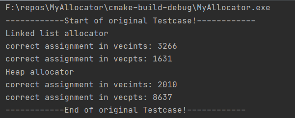
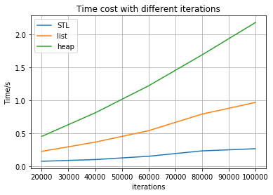
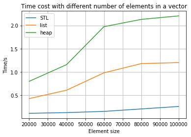
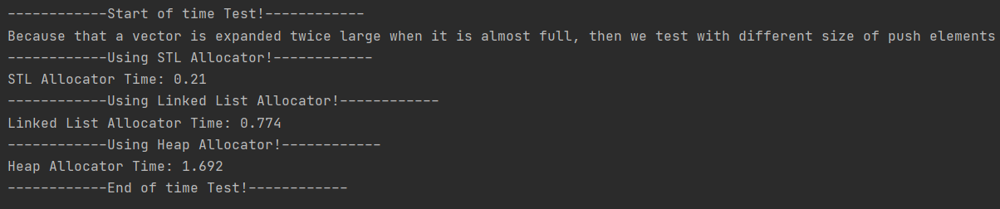
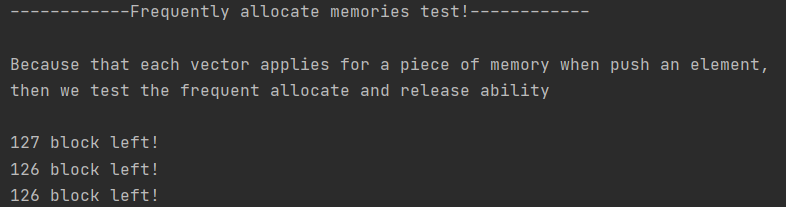
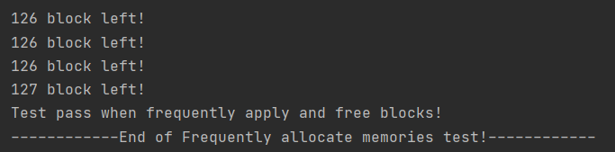
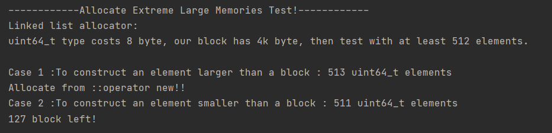
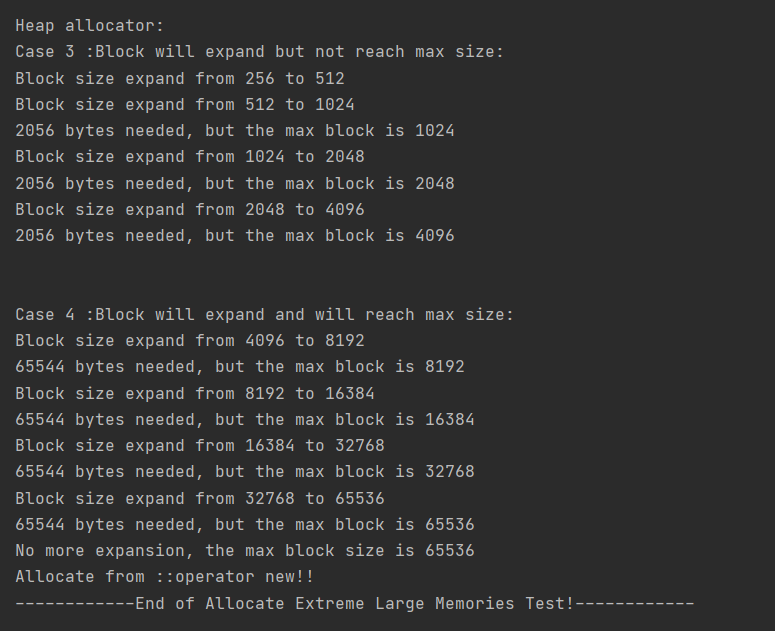

# My Allocator
## Test Case Design
For the whole project, I designed two ways: using linked list and min-heap to store the available blocks(using heap in order to allocate different sizes of blocks in the sequence of size, so that we can assign blocks at a small size initially and expand the block size step by step).

**Note that during your test, you may need to uncomment some lines to get the same result as follows,.**

**Because that such as `std::cout << "Allocate from ::operator new!!" <<std::endl;` line have been commented before handing in.**

### Original Test

It is clear that both of my allocators can pass the original test case.




### Time Cost Test
In this case, we test the time result of sequentially push some elements into vectors with different iterations. Then draw the cost time trend along with either different push iterations and push element size.

We test push `push_size` elements into each vector with `cycle` times, `cycle` refers to the different iterations in our test.
```c++
std::cout << "------------Using STL Allocator!------------" << std::endl;
int push_size = 10;
start = clock();
for(auto i = 0; i < cycle; i++){
    std::vector<int, std::allocator<int> > tmp;
    // Push 4 elements to test twice memory expand and copy of vector
    for(auto j = 0; j < push_size; j++){
        tmp.push_back(j);
    }
}
std::cout << "STL Allocator Time: ";
std::cout << (((double)clock() - start) / CLOCKS_PER_SEC) << "\n";

std::cout << "------------Using Linked List Allocator!------------" << std::endl;
for(auto i = 0; i < cycle; i++){
    std::vector<int, ListAllocator<int> > tmp;
    // Push 4 elements to test twice memory expand and copy of vector
    for(auto j = 0; j < push_size; j++){
        tmp.push_back(j);
    }
}
std::cout << "Linked List Allocator Time: ";
std::cout << (((double)clock() - start) / CLOCKS_PER_SEC) << "\n";
//    return 0;
std::cout << "------------Using Heap Allocator!------------" << std::endl;

for(auto i = 0; i < cycle; i++){
    std::vector<int, HeapAllocator<int> > tmp;
    // Push 4 elements to test twice memory expand and copy of vector
    for(auto j = 0; j < push_size; j++){
        tmp.push_back(j);
    }
}
std::cout << "Heap Allocator Time: ";
std::cout << (((double)clock() - start) / CLOCKS_PER_SEC) << "\n\n";
```
#### Independent variable--Push iterations
Test with each `push_size=10`.

| **Size/(iterations)**       | 20000 | 40000 | 60000 | 80000 | 100000 |
| --------------------------- | ----- | ----- | ----- | ----- | ------ |
| **STL Allocator/s**           | 0.073 | 0.099 | 0.149 | 0.231 | 0.264  |
| **Linked List Allocator/s** | 0.223 | 0.364 | 0.538 | 0.79  | 0.968  |
| **Heap Allocator/s**        | 0.451 | 0.809 | 1.22  | 1.69  | 2.182  |

#### Independent variable--Number of elements for each iteration
Test with `cycle = 10000` iterations.

| **Size/(push size)**      | 200   | 400   | 600   | 800   | 1000  |
| ------------------------- | ----- | ----- | ----- | ----- | ----- |
| **STL Allocator/s**        | 0.11  | 0.125 | 0.151 | 0.204 | 0.257 |
| **Linked List Allocator/s** | 0.426 | 0.607 | 0.98  | 1.179 | 1.2   |
| **Heap Allocator/s**        | 0.797 | 1.156 | 1.972 | 2.129 | 2.204 |


Then we can draw the time cost trend:

The mainly reason that the linked list allocator is a bit slower than that in STL is because that we need to maintain a list storing the valid blocks, otherwise if we can store the pure pointer address to available blocks in a piece of specific known address, it might speed up.

For heap allocator, we use a priority queue to maintain the valid blocks and the blocks are with different sizes, so the initial block size is relatively small. When the push size is small, we do not need to allocate large blocks, but when we encounter larger memory block need, in my allocator, you need to expand the block size with twice than before, so in order to get the need size, you may have to allocate a lot of useless memory blocks, thus you can see in the second graph, for larger size of allocation, there exists some steep line in time cost , because the allocator re-allocates larger size blocks.

**Time with different iterations:**




**Time with different number of elements for each iteration:**




Sample test output:


### Frequently allocate memories test
This testcase tests the performance of the allocator when blocks of memory need to frequently allocated and deleted. We create a lot of new vectors and store then in a vector containing vectors. 
After that, we test the correctness of the elements in the vectors.
**Allocate test:**

```c++
std::vector<std::vector<int, ListAllocator<int> > > vecs;
int max_vectors = 127;
for(auto i = 0; i < max_vectors; i++){
    std::vector<int, ListAllocator<int> > t ;
    for(auto j = 0; j < 100; j++){
        t.push_back(j);
    }
    vecs.push_back(t);
}
```

**Correctness test:**

```c++
int test_vec = gen() % max_vectors;
bool correct = true;
for(auto i = 0; i < vecs[test_vec].size(); i++){
    int element =vecs[test_vec].at(i);
    assert(element == i); // If the memory allocation has error, then it will assert.
    if( element != i){
        std::cout << "An Error occurs when frequently apply and free." <<std::endl;
        correct = false;
        break;
    }
}
if(correct){
    std::cout << "Test pass when frequently apply and free blocks!" <<std::endl;
}
```

During test, some test code are added to allocator to monitor the left available blocks(We have 128 blocks initially):



**Test Result:(Both of Linked list allocator and Heap allocator can pass the test)**



### Allocate Large Memories Test
Because that our memory has a maximum block of 4k bytes, then we need to test to allocate larger memory.
Test code::

```c++
std::cout << "------------Allocate Extreme Large Memories Test!------------" << std::endl;
std::cout << "Linked list allocator:" << std::endl;
std::cout << "uint64_t type costs 8 byte, our block has 4k byte, then test with at least 512 elements.\n" << std::endl;
std::cout << "Case 1 :To construct an element larger than a block : 513 uint64_t elements" << std::endl;
std::vector<uint64_t, ListAllocator<uint64_t> > large_test1(513);
std::cout << "Case 2 :To construct an element smaller than a block : 511 uint64_t elements" << std::endl;
std::vector<uint64_t, ListAllocator<uint64_t> > large_test2(511);
std::cout << std::endl << std::endl;

std::cout << "Heap allocator:" << std::endl;
std::cout << "Case 3 :Block will expand but not reach max size:" << std::endl;
std::vector<uint64_t, HeapAllocator<uint64_t> > large_test3(257); // Try to assign large piece of memory
std::cout << std::endl << std::endl;

std::cout << "Case 4 :Block will expand and will reach max size:" << std::endl;
std::vector<uint64_t, HeapAllocator<uint64_t> > large_test4(8193); // Try to assign largest piece of memory
std::cout << "------------End of Allocate Extreme Large Memories Test!------------" << std::endl;
```

**Test results:**

Note that I added some code to test the allocated memory module so that you may monitor the memory allocation process:

#### Linked list allocator

For Linked List Allocator, if the needed block is larger than 4k, it will allocates memory from system.



#### Heap allocator

For Heap Allocator, if the needed block is larger than the largest one, it will double its size and allocate new blocks until the needed memory is too much, the block size will be not greater than `expand_max`, which is 65536 bytes in current project.

In case 3, the block size expand but not reach maximum, then it get allocated.

In case 4, it reaches the maximum block size and system will allocate memory for it through `::operator new`




